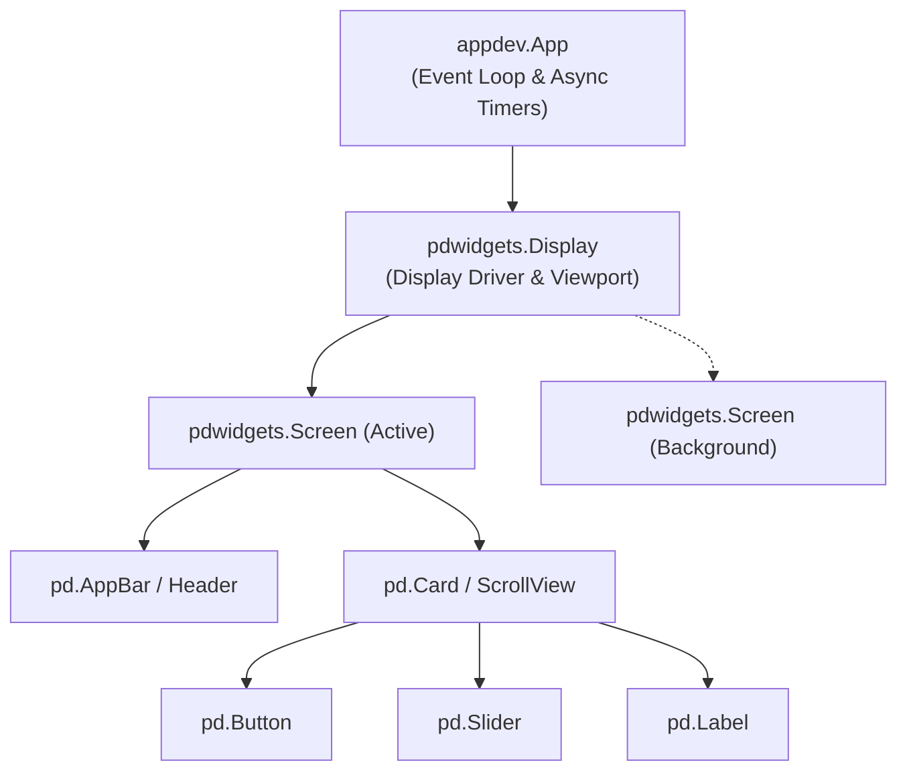
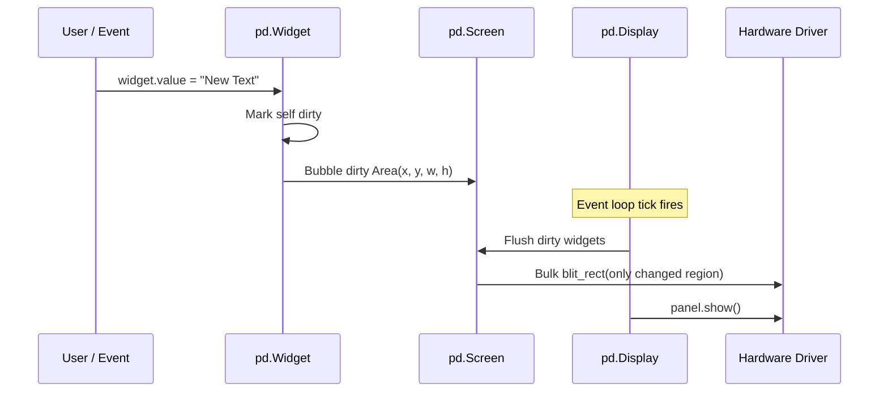
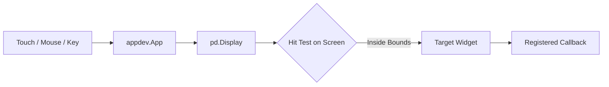

# Architecture & Lifecycle

An overview of `pdwidgets`'s component hierarchy, dirty-rectangle rendering pipeline, and event model.

---

## 🌲 Component Hierarchy

Every `pdwidgets` UI forms a tree starting with an `App` controller, a root `Display` viewport, an active `Screen`, and nested `Widget` containers:



### Core Hierarchy Classes:
1. **`Display`**: Glues the physical display driver (`display_drv`) to the application event loop. Tracks focus navigation and routes input events.
2. **`Screen`**: Represents a full-screen canvas. You can define multiple screens and switch between them using `display.show_screen(new_screen)`.
3. **`Widget`**: The base class for all UI elements. Owns geometry (`x, y, w, h`), visibility, parent/child relationships, background color, corner radius, and event callbacks.

---

## ⚡ The Rendering Pipeline & Dirty Rectangles

`pdwidgets` avoids costly full-screen redraws on embedded microcontrollers by tracking **dirty rectangles**:



### Lifecycle Rules:
* **Modifying State**: When you change a property (e.g. `widget.value = "..."` or `widget.bg = 0xF800`), the widget computes its bounding `Area` and schedules a redraw.
* **Flushing Draws**: In an asynchronous application (`app.run()`), redraws happen automatically on each frame tick.
* **Pre-run Setup**: If you configure widgets in a loop *before* calling `app.run()`, call `pd.tick()` to force-render intermediate states.

---

## 🎮 Event Dispatch Pipeline

Input events from touch screens, mouse pointers, rotary encoders, or keyboards flow cleanly from the hardware driver to the targeted widget:



### Event Callback Signature:
Callbacks registered with `add_event_cb` receive `(sender, event)`:

```python
def button_handler(sender, event):
    print(f"Widget {sender} received event {event.type}")

button.add_event_cb(pd.events.MOUSEBUTTONUP, button_handler)
```
